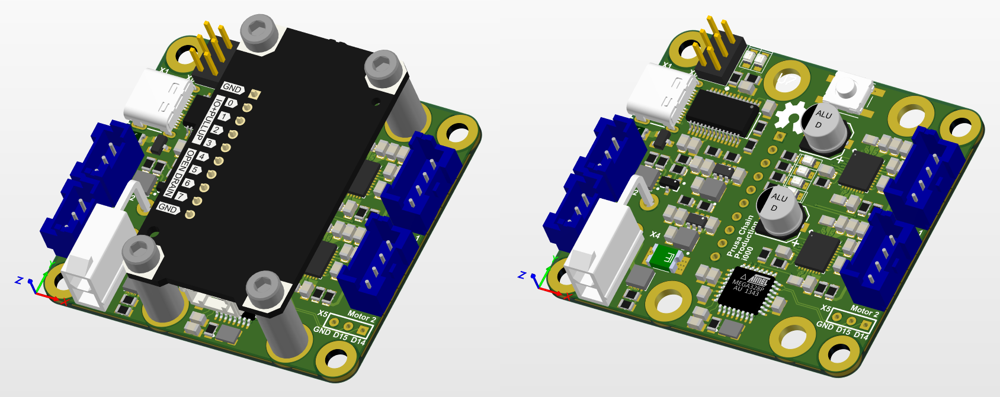
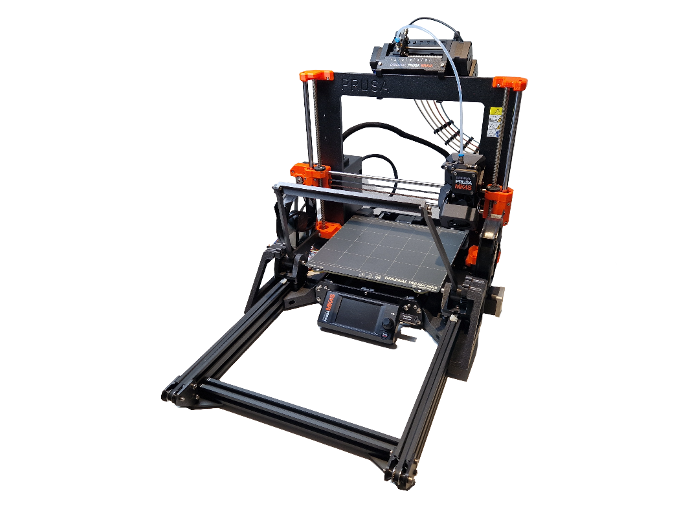

# Prusa Chain Production System

This repository is a fork of [prusa-chain-production](https://github.com/d-weber/prusa-chain-production) by d-weber. Visit the original repository to watch a video of the system in action.

## Overview

- The original project was designed for the Prusa i3 MK3. This version has been adapted for the **Prusa MK4s**.
- A redesigned **Ejector PCB** has been developed, now called the **Prusa Chain Production PCB**.
- The control system has been updated to use the [Prusa GPIO Hackerboard](https://www.prusa3d.com/cs/produkt/gpio-hackerboard-set/) instead of OctoPi.
- A 3D model of the GPIO Hackerboard with mounting parts has been created and is available here: [Prusa GPIO Hackerboard](https://www.printables.com/model/1128260-prusa-gpio-hackerboard).
- The project has been tested and is functional, but it has not yet been used in a production environment.

## How It Works

1. Add the G-code from the file `Automated_Part_Removal.gcode` as **Custom End G-Code** in your slicer. This G-code contains commands to control the GPIO pins on the Hackerboard.
2. The printer communicates with the **Prusa Chain Production PCB** via the GPIO Hackerboard.
3. The **Prusa Chain Production PCB** controls the fans and motors for automated part removal.

## Ejector PCB

- The PCB design files are hosted on CircuitMaker: [Prusa Chain Production](https://workspace.circuitmaker.com/Projects/Details/Patrick-Rossacher-2/Prusa-Chain-Production).
- The PCB uses an **ATMEGA328P-AU** microcontroller. To set it up:
  1. Flash an Arduino bootloader via the SPI connector (X8). Use [MiniCore](https://github.com/MCUdude/MiniCore#minicore) for this process. A guide for flashing the bootloader can be found here: [Arduino as ISP and Arduino Bootloaders](https://docs.arduino.cc/built-in-examples/arduino-isp/ArduinoISP/).
  2. Once the bootloader is flashed, the firmware can be uploaded via USB.

## Prusa Chain Production Mod on MK4s

## Notes

- All mechanical parts and the bill of materials for purchasing components can be found in the original repository by d-weber.
- This project is a proof of concept and has not been used in a production setting.
